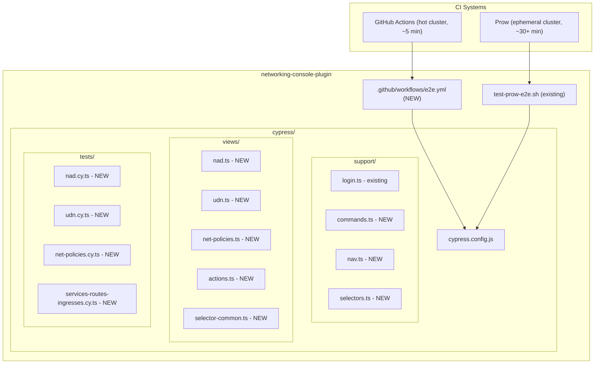

# Migrate Networking E2E Tests to networking-console-plugin

**Jira Epic:** [CNV-87983](https://redhat.atlassian.net/browse/CNV-87983) — "Move network & nmstate E2E tests from kubevirt-ui to upstream plugin repos"

## Source Analysis

Two branches of kubevirt-ui are relevant:

- **`release-4.21`** — contains the Cypress tests (`cypress/tests/tier2/networking/`). These are the **primary source to copy** since they are already Cypress and did not differ much from `main`.
- **`main`** — Cypress tests removed; only Playwright versions remain (`playwright/tests/tier2/networking/`). Use as **reference for any newer test logic** added after the Cypress versions were dropped.

| Cypress file (release-4.21) | Lines | Plugin owner |
|---|---|---|
| `services.cy.ts` | 32 | networking-console-plugin |
| `routes.cy.ts` | 40 | networking-console-plugin |
| `ingresses.cy.ts` | 32 | networking-console-plugin |
| `nad-bridge.cy.ts` | 139 | networking + kubevirt (VM parts) |
| `nad-localnet.cy.ts` | 63 | networking + kubevirt (VM parts) |
| `nad-ovn.cy.ts` | 67 | networking + kubevirt (VM parts) |
| `net-policies.cy.ts` | 98 | networking-console-plugin |
| `udn.cy.ts` | 192 | networking + kubevirt (VM parts) |

| Playwright file (main) | Lines | Plugin owner |
|---|---|---|
| `net-nad.spec.ts` | 727 | networking + kubevirt |
| `s-r-i.spec.ts` | 62 | networking-console-plugin |
| `nnc-p.spec.ts` | 432 | nmstate-console-plugin |
| `hotplug.spec.ts` | 31 | kubevirt-plugin |

## Tests to Migrate (networking-console-plugin owned)

**From `net-nad.spec.ts` — UDN section:**
- create UDN-enabled namespace (via shell/oc, not UI)
- ID(CNV-11867) create UDN
- ID(CNV-11871) create CUDN
- ID(CNV-11874) delete CUDN

**From `net-nad.spec.ts` — NAD section:**
- ID(CNV-3256) create Linux bridge NAD with MAC Spoof checked
- ID(CNV-3256) create secondary localnet NAD
- ID(CNV-4288) delete secondary localnet NAD
- ID(CNV-3256) create L2 overlay NAD

**From `net-nad.spec.ts` — NetworkPolicy section:**
- visit NetworkPolicies page
- create NetworkPolicy with form
- create MultiNetworkPolicy with form (currently `test.skip`)

**From `s-r-i.spec.ts`:**
- Create Service (YAML)
- Create Route (form)
- Create Ingress (YAML)

**Stays in kubevirt-ui** (VM-dependent — needs API-based setup after migration):
- VM creation tests (CNV-11869, CNV-11868, CNV-11873, CNV-11872) — create VM with UDN/CUDN
- VM + NAD tests (create VMs with bridge/localnet/OVN NAD, verify IP)
- NAD hotplug swap (CNV-15953)
- `hotplug.spec.ts` (all stubs)

These tests currently rely on preceding tests in the same file to create UDN/CUDN/NAD resources. After migration, those resources must be created via API (oc/kubectl) as test setup in kubevirt-ui.

**Goes to nmstate-console-plugin:**
- `nnc-p.spec.ts` entirely (NNCP, NNS, Physical networks, VM networks)

## Architecture



## Migration Strategy

The `release-4.21` Cypress tests are the primary source — copy them and adapt (fix imports, strip VM tests). Cross-reference with `main` Playwright specs only to check for newer test logic that may have been added after the Cypress versions were dropped.

### What to copy from kubevirt-ui `release-4.21`

| Source | Copy to networking-console-plugin |
|---|---|
| `cypress/views/nad.ts` | `cypress/views/nad.ts` |
| `cypress/views/udn.ts` | `cypress/views/udn.ts` |
| `cypress/views/actions.ts` (partial) | `cypress/views/actions.ts` |
| `cypress/views/selector-common.ts` (partial) | `cypress/views/selector-common.ts` |
| `cypress/views/selector-template.ts` (partial) | `cypress/views/selector-common.ts` |
| `cypress/support/nav.ts` (networking parts) | `cypress/support/nav.ts` |
| `cypress/support/selectors.ts` | `cypress/support/selectors.ts` |
| `cypress/support/commands.ts` (partial) | `cypress/support/commands.ts` |
| `cypress/utils/const/nad.ts` | `cypress/utils/const/nad.ts` |
| `cypress/utils/const/index.ts` (partial) | `cypress/utils/const/index.ts` |
| `cypress/utils/types/nad.ts` | `cypress/utils/types/nad.ts` |

### What needs adaptation

- **Remove VM-dependent code**: all `vm.*` calls, `cy.deleteVM()`, `VirtualMachineData` imports, VM status assertions
- **Remove kubevirt-specific imports**: `TEMPLATE`, `vm-flow`, `tab`, `vm` view modules
- **Remove kubevirt-perspective switching**: `cy.beforeSpec()` switches to Virtualization perspective — networking tests should stay in Administrator perspective
- **Fix relative import paths**: `../../../views/` -> `../views/` (flatter structure)
- **Keep only networking custom commands**: `cy.visitNAD()`, `cy.visitUDN()`, `cy.switchProject()`, `cy.deleteResource()`

## Implementation Steps

### 1. Cypress support infrastructure (`cypress/support/`)

- **`support/selectors.ts`** — `cy.byTestID()`, `cy.byButtonText()`, `cy.checkTitle()`, `cy.checkSubTitle()`, `cy.switchProject()`, `cy.clickNavLink()`, `cy.clickBtn()`
- **`support/commands.ts`** — `cy.deleteResource(kind, name, ns)`, `cy.beforeSpec()`
- **`support/nav.ts`** — `cy.visitNAD()`, `cy.visitUDN()`, `cy.visitService()`

### 2. Views and constants

- **`views/nad.ts`** — `createNAD(nad: NadData)`, `deleteNAD(name: string)` + selectors
- **`views/udn.ts`** — `createUDN(project, subnet)`, `createClusterUDN(name, subnet, nsSelector)`, `deleteClusterUDN(name)`
- **`views/net-policies.ts`** — `denyTraffic()`, form radio/name fill helpers
- **`views/actions.ts`** — `checkActionMenu(kind)`, `getRow(name, within)`
- **`views/selector-common.ts`** — `row`, `brCrumbItem`, `itemFilter`, `createBtn`, `confirmBtn`
- **`utils/const/index.ts`** — `TEST_NS`, `UDN_NS`, `adminOnlyDescribe`, test names
- **`utils/const/nad.ts`** — `NAD_BRIDGE`, `NAD_OVN`, `NAD_LOCALNET` data objects
- **`utils/types/nad.ts`** — `NadData` interface

### 3. Copy and adapt spec files

| New file | Copies from (release-4.21) | Adaptations |
|---|---|---|
| `tests/udn.cy.ts` | `cypress/tests/tier2/networking/udn.cy.ts` | Remove VM creation tests + Passt section; keep create UDN, create CUDN, delete CUDN. UDN-enabled namespace created via shell (`oc`/`kubectl`) in `before()` hook, not via UI |
| `tests/nad-bridge.cy.ts` | `cypress/tests/tier2/networking/nad-bridge.cy.ts` | Remove VM creation/IP verification tests; keep `createNAD(NAD_BRIDGE)` |
| `tests/nad-localnet.cy.ts` | `cypress/tests/tier2/networking/nad-localnet.cy.ts` | Remove VM test; keep create + delete NAD |
| `tests/nad-ovn.cy.ts` | `cypress/tests/tier2/networking/nad-ovn.cy.ts` | Remove VM tests; keep `createNAD(NAD_OVN)` |
| `tests/net-policies.cy.ts` | `cypress/tests/tier2/networking/net-policies.cy.ts` | Keep as-is (MultiNetworkPolicy already xit) |
| `tests/services.cy.ts` | `cypress/tests/tier2/networking/services.cy.ts` | Adapt imports only |
| `tests/routes.cy.ts` | `cypress/tests/tier2/networking/routes.cy.ts` | Adapt imports only |
| `tests/ingresses.cy.ts` | `cypress/tests/tier2/networking/ingresses.cy.ts` | Adapt imports only |

**Total: ~14 test cases** across 8 files

### 4. GitHub Actions hot-cluster CI

Create `.github/workflows/e2e.yml` following kubevirt-plugin PR #3713:
- Self-hosted runner on persistent OpenShift cluster
- Secrets: `CONSOLE_URL`, `KUBEADMIN_PASSWORD`
- Runs `npm run test-cypress-headless`
- Uploads JUnit + screenshots as artifacts
- ~5 min feedback loop

### 5. Prow CI (existing)

[`test-prow-e2e.sh`](../test-prow-e2e.sh) already runs `npm run test-cypress-headless`. Once specs are in place, it will run them with no script changes. A Prow job definition may need to be added/updated in `openshift/release`.

### 6. Update kubevirt-ui (post-migration)

The VM-dependent tests remaining in kubevirt-ui will break because they relied on UDN/CUDN/NAD creation from preceding tests in the same file. These need API-based setup:
- `oc apply -f` or `cy.exec('oc create ...')` to create UDN/CUDN/NAD resources before VM tests run
- This is tracked as part of the kubevirt-ui side of CNV-87983

### 7. Update Jira CNV-87983

- Update epic description with PR links
- Progress subtask CNV-87989 ("automated tests")
- Document which tests were migrated, which stay (with API setup), and which go to nmstate-console-plugin

## File Structure (final)

```
cypress/
  cypress.config.js
  tsconfig.json
  plugins/
    index.ts
  support/
    index.ts
    login.ts
    commands.ts
    nav.ts
    selectors.ts
  views/
    nad.ts
    udn.ts
    actions.ts
    selector-common.ts
  utils/
    types/
      nad.ts
    const/
      index.ts
      nad.ts
      scale.ts
  tests/
    nad-bridge.cy.ts
    nad-localnet.cy.ts
    nad-ovn.cy.ts
    udn.cy.ts
    net-policies.cy.ts
    services.cy.ts
    routes.cy.ts
    ingresses.cy.ts
.github/
  workflows/
    e2e.yml                   (hot-cluster CI)
test-prow-e2e.sh              (updated screenshots path)
```

## Key Design Decisions

- **Copy from Cypress (release-4.21)** — the primary source; tests did not differ much between release-4.21 and main
- **Cross-reference Playwright (main)** — check for any newer logic added after Cypress was dropped
- **Strip VM-dependent tests, don't delete them** — they stay in kubevirt-ui and will need API-based setup (create UDN/CUDN/NAD via `oc apply`) as a precondition instead of relying on prior UI tests
- **adminOnlyDescribe** — NAD/UDN tests require admin privileges; guard with `Cypress.expose('NON_PRIV')` check
- **beforeSpec without Virtualization perspective** — kubevirt-ui's `cy.beforeSpec()` switches to Virtualization perspective; our version should remain in Administrator perspective since networking resources are accessed from there
- **UDN namespace via shell** — UDN-enabled namespace creation uses `cy.exec('oc ...')` (shell/API), matching the kubevirt-ui approach where it's done in global setup via `setupTestNamespace(namespace, { 'k8s.ovn.org/primary-user-defined-network': '' })`. In Cypress this translates to `cy.exec('oc create namespace ...')` + label application
