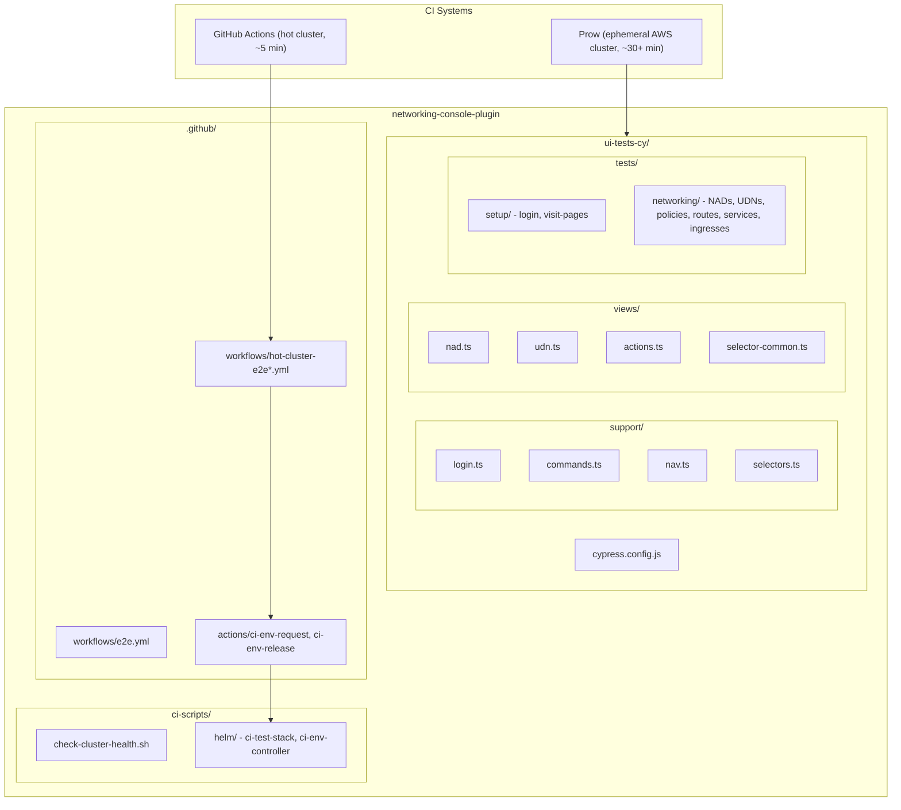

# Migrate Networking E2E Tests to networking-console-plugin

**Jira Epic:** [OCPNETUI-56](https://redhat.atlassian.net/browse/OCPNETUI-56)

## Source Analysis

Two branches of kubevirt-ui are relevant:

- **`release-4.21`** — contains the Cypress tests (`cypress/tests/tier2/networking/`). These are the **primary source to copy**.
- **`main`** — Cypress tests removed; only Playwright versions remain. Use as **reference for newer test logic**.

| Cypress file (release-4.21) | Lines | Plugin owner |
|---|---|---|
| `services.cy.ts` | 32 | networking-console-plugin |
| `routes.cy.ts` | 40 | networking-console-plugin |
| `ingresses.cy.ts` | 32 | networking-console-plugin |
| `nad-bridge.cy.ts` | 139 | networking + kubevirt (VM parts) |
| `nad-localnet.cy.ts` | 63 | networking + kubevirt (VM parts) |
| `nad-ovn.cy.ts` | 67 | networking + kubevirt (VM parts) |
| `net-policies.cy.ts` | 98 | networking-console-plugin |
| `udn.cy.ts` | 192 | networking + kubevirt (VM parts) |

## Tests Migrated (networking-console-plugin owned)

**NAD tests:**
- create Linux bridge NAD with MAC Spoof checked
- create secondary localnet NAD + delete
- create L2 overlay NAD

**UDN tests:**
- create UDN
- create ClusterUDN
- delete ClusterUDN

**Network policy tests:**
- visit NetworkPolicies page
- create NetworkPolicy with form

**Service/Route/Ingress tests:**
- create Service (YAML)
- create Route (form)
- create Ingress (YAML)

**Stays in kubevirt-ui** (VM-dependent):
- VM creation tests — create VM with UDN/CUDN/NAD
- VM + NAD IP verification tests
- NAD hotplug swap

**Goes to nmstate-console-plugin:**
- `nnc-p.spec.ts` entirely (NNCP, NNS, Physical networks)

## Architecture


```mermaid
graph TD
    subgraph ciSystems [CI Systems]
        ghActions["GitHub Actions (hot cluster, ~5 min)"]
        prow["Prow (ephemeral AWS cluster, ~30+ min)"]
    end

    subgraph repo [networking-console-plugin]
        subgraph uiTestsCy [ui-tests-cy/]
            cypressConfig[cypress.config.js]
            subgraph support [support/]
                login[login.ts]
                commands[commands.ts]
                nav[nav.ts]
                selectors[selectors.ts]
            end
            subgraph views [views/]
                nadView[nad.ts]
                udnView[udn.ts]
                actionsView[actions.ts]
                selectorCommon[selector-common.ts]
            end
            subgraph tests [tests/]
                setupTests[setup/ - login, visit-pages]
                networkingTests[networking/ - NADs, UDNs, policies, routes, services, ingresses]
            end
        end
        subgraph ciScripts [ci-scripts/]
            healthCheck[check-cluster-health.sh]
            helmCharts[helm/ - ci-test-stack, ci-env-controller]
        end
        subgraph ghWorkflows [.github/]
            e2eYml[workflows/e2e.yml]
            hotCluster[workflows/hot-cluster-e2e*.yml]
            actions[actions/ci-env-request, ci-env-release]
        end
    end

    ghActions --> hotCluster
    prow --> uiTestsCy
    hotCluster --> actions --> helmCharts
```

## CI Approaches

### 1. Prow (existing — ephemeral cluster)

[`test-prow-e2e.sh`](../test-prow-e2e.sh) runs `npm run test-cypress-headless` on a fresh AWS cluster provisioned per run. ~30+ min total (cluster provisioning dominates).

### 2. GitHub Actions — simple (e2e.yml)

Runs on `ubuntu-latest` with secrets for an existing cluster URL. Fastest to set up but requires a pre-configured cluster with the plugin deployed.

### 3. GitHub Actions — hot cluster (hot-cluster-e2e*.yml)

Uses a persistent OpenShift cluster with ARC (Actions Runner Controller) for self-hosted ephemeral runners. The ci-env-controller provisions per-run test stacks via Helm. ~5 min feedback loop.

Cluster credentials are injected via GitHub Actions secrets (`CLUSTER_API`, `CLUSTER_TOKEN`). See `ui-tests-cy/CLUSTER.md` for setup steps.

### 4. Local development

```bash
# Terminal 1: start plugin dev server
npm run dev

# Terminal 2: start console
npm run start-console

# Terminal 3: run tests
./test-cypress.sh           # headless
./test-cypress.sh -g true   # GUI mode
```

## File Structure

```
ui-tests-cy/
  cypress.config.js
  tsconfig.json
  .eslintrc
  reporter-config.json
  PLAN.md
  MIGRATION.md
  CLUSTER.md
  plugins/
    index.ts                  (webpack preprocessor, cy.task registration, env config)
  support/
    index.ts
    login.ts
    commands.ts               (cy.deleteResource via cy.task, cy.switchProject)
    nav.ts                    (cy.visitNAD, cy.visitUDN, cy.visitService)
    selectors.ts              (cy.byTestID, cy.byButtonText, cy.clickNavLink, etc.)
  views/
    nad.ts                    (createNAD, deleteNAD)
    udn.ts                    (createUDN, createClusterUDN, deleteClusterUDN)
    actions.ts                (checkActionMenu, getRow)
    selector-common.ts        (shared selectors)
  utils/
    types/
      nad.ts                  (NadData type)
    const/
      base.ts                 (TEST_NS, UDN_NS, MINUTE, SECOND)
      nad.ts                  (NAD_BRIDGE, NAD_OVN, NAD_LOCALNET data)
  tests/
    all.cy.ts                 (imports all specs in order)
    setup/
      login.cy.ts
      visit-pages.cy.ts
    networking/
      nad-bridge.cy.ts
      nad-localnet.cy.ts
      nad-ovn.cy.ts
      udn.cy.ts
      net-policies.cy.ts
      services.cy.ts
      routes.cy.ts
      ingresses.cy.ts
ci-scripts/
  check-cluster-health.sh
  test-cleanup.sh
  start-console.sh
  start-plugin-container.sh
  resolve-console-image.sh
  _cluster-helpers.sh
  nginx-9080.conf / nginx-9443.conf
  helm/
    ci-test-stack/            (console + plugin Helm chart)
    ci-env-controller/        (lifecycle controller Helm chart)
.github/
  actions/
    ci-env-request/           (composite action: provision test env)
    ci-env-release/           (composite action: tear down test env)
  workflows/
    e2e.yml                   (simple CI on ubuntu-latest)
    hot-cluster-e2e.yml       (entry point: PR gate + health check)
    hot-cluster-e2e-run.yml   (build image, provision, test, cleanup)
Dockerfile.ci                 (UBI9-based build for GitHub Actions)
.dockerignore
setup.sh / cleanup.sh / test-cypress.sh / research-flakiness.sh
```

## Key Design Decisions

- **Copy from Cypress (release-4.21)** — the primary source
- **Strip VM-dependent tests** — they stay in kubevirt-ui with API-based setup
- **`ui-tests-cy/` directory** — separate from `integration-tests/` (legacy Prow suite)
- **`cy.task` over `cy.exec`** — `cy.exec` is deprecated; `cy.task('execOc')` delegates to Node process
- **No video recording** — screenshots on failure are sufficient for CI debugging
- **FIPS workarounds** — `GOLANG_FIPS=0` and `OPENSSL_FORCE_FIPS_MODE=0` for RHOS clusters
- **UDN namespace via shell** — created with OVN label at creation time (admission policy)
